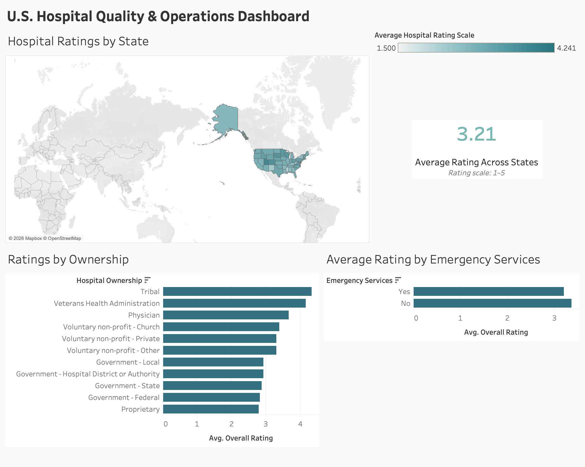

# U.S. Hospital Quality & Operations Analysis

## Overview
This healthcare analytics project analyzes U.S. hospital quality data using PostgreSQL and Tableau. The project explores differences in hospital ratings across states, ownership structures, and emergency service availability.

## Data Source
The analysis uses CMS Hospital General Information data, which contains information on U.S. hospitals including facility characteristics, ownership, emergency services, safety measures, and overall hospital ratings.

## Tools
- PostgreSQL
- SQL
- Tableau
- DBeaver

## Analysis
SQL was used to clean and prepare the hospital dataset for analysis, including:
- Converting hospital rating and safety fields into numeric values
- Handling unavailable values as NULL
- Preserving six-digit CMS facility identifiers
- Creating an analysis-ready SQL view
- Comparing hospital ratings across states and ownership categories
- Evaluating ratings based on emergency service availability

## Dashboard

The interactive Tableau dashboard includes:
- Average U.S. hospital rating
- Hospital ratings by state
- Average ratings by hospital ownership
- Comparison of hospitals with and without emergency services
- State-level filtering for interactive analysis

## Key Findings
- The average hospital rating in the analyzed data was approximately **3.21 out of 5**.
- Hospital ratings varied geographically across U.S. states.
- Average ratings differed across hospital ownership structures.
- Hospitals with and without emergency services showed differences in average overall ratings.

## Repository Files
- `hospital_analysis.sql` — SQL data cleaning and analysis
- `hospital_quality_dashboard.png` — Tableau dashboard visualization
